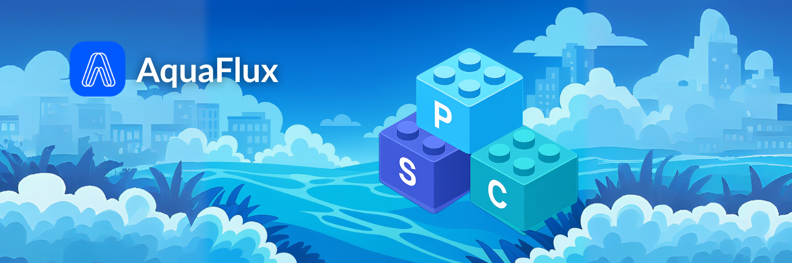

# Welcome to AquaFlux

## Meet AquaFlux

Bored of “sit-and-wait” bonds & copy-paste DeFi?&#x20;

Say hello to AquaFlux — the LEGO factory for Real-World Assets.

<figure><figcaption></figcaption></figure>

## What is AquaFlux

AquaFlux is a DeFi protocol that unlocks real-world asset liquidity and yield through its **Tri-Token model**, **P**(principal), **C**(coupon), and **S**(safety) — enabling users to customize **risk** and **return** on-chain.

Ready to dive in ?  [Get Started](product/introduction.md)
