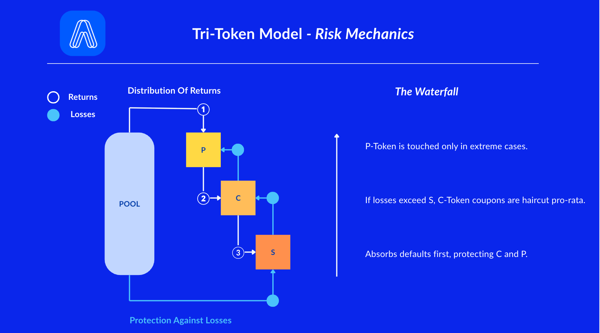

# Risk Waterfall

### TL;DR

* **Returns flow “top-down”:** cash first fulfills **P (principal)**, then **C (coupons)**, and any **extra** can flow to **S** (fee share / residual buffer).
* **Losses flow “bottom-up”:** **S** takes losses **first** (first-loss shield), then **C** is reduced if needed, and **P** is only touched in **extreme** cases.

<figure><figcaption></figcaption></figure>

### Two flows

#### 1) Distribution of Returns (when money comes in)

1. **P-Token (Principal)** – principal repayments are honored first.
2. **C-Token (Coupon)** – scheduled interest is paid next.
3. **S-Token (Shield)** – receives its **coupon/fee share** and, at maturity, any **unused safety buffer** (residual).

> Plain: first pay back **what was owed**, then pay **income**, then share **leftovers** per pool rules.

#### 2) Protection Against Losses (when default)

1. **S-Token loses first** – the first-loss buffer absorbs defaults and shortfalls.
2. **C-Token is next** – if losses exceed S, C’s coupons (and, if needed, principal value of C) are **haircut pro-rata** (everyone takes the same % cut).
3. **P-Token last** – only if losses still remain after S and C would P be affected.

> Plain: **S is the airbag.** If the crash is bigger than the airbag, **C** gets dented. **P** is protected unless the crash is severe.

### Simple examples

**Pool:** $100 total. **S coverage:** 10% (a $10 buffer).

* **No loss:**
  * P receives principal at maturity;
  * C receives coupons on schedule;
  * S receives its coupon/fee share during the term and any **unused** part of the $10 buffer at maturity.
* **$6 loss:**
  * S absorbs **$6**.
  * P and C are **not** touched.
* **$15 loss:**
  * S absorbs **$10** (used up).
  * Remaining **$5** reduces **C** (pro-rata).
  * P still **untouched**.
* **$28 loss:**
  * S absorbs **$10** → C absorbs **$18** (pro-rata).
  * If anything still remains, it would then reduce **P**.

### FAQ

**What does “haircut pro-rata” mean?**\
Every holder in that token takes the **same percentage** reduction.

**Can P be affected?**\
Only in **severe** loss scenarios **after** S and **after** C are reduced.

**Does S always get residuals?**\
Only if the asset repays in full and the safety buffer is **unused** (per pool rules).

**Do these rules ever change?**\
Each pool defines its own parameters (coverage, fee shares, schedules). Always check the pool’s settings in the dApp.
