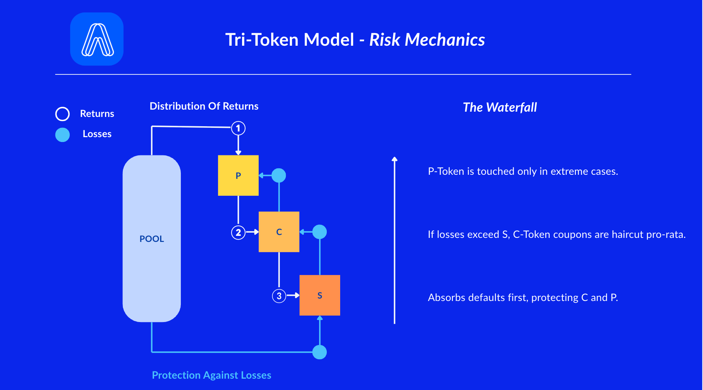

# Risk Waterfall

### TL;DR

* **Returns flow top-down:** cash first fulfills **P (principal)**, then **C (coupons)**, and any **surplus** flows to **S**.
* **Losses flow bottom-up:** **S** absorbs losses **first** (the airbag), then **C** is reduced, and **P** is only touched in **extreme** cases.

<figure><figcaption></figcaption></figure>

***

### Two flows, One System

#### 1) Distribution of Returns (when money comes in)

1. **P-Token (Principal)** – Principal repayments are honored first.
2. **C-Token (Coupon)** – Scheduled interest payments are distributed next.
3. **S-Token (Shield)** – eceives its **coupon/fee share** and, at maturity, any **unused safety buffer** (residual).

> Think of it like a waterfall flowing over three ledges. The top pool (P) fills first. Overflow goes to the second pool (C). Whatever is left cascades down to the third pool (S).

#### 2) Protection Against Losses (when default)

When the underlying asset loses value or defaults, losses are absorbed in the **opposite** direction:

1. **S-Token loses first** – The first-loss buffer absorbs defaults and shortfalls, up to its full coverage.
2. **C-Token is next** – If losses exceed S, C holders take a pro-rata haircut (everyone takes the same percentage cut).
3. **P-Token last** – Only if losses remain after S and C are both exhausted would P be affected.

> Think of S as the **airbag** in your car. In a small accident, the airbag absorbs the impact and you walk away fine. In a bigger crash, the airbag still helps, but the car (C) takes some damage. Only in a catastrophic wreck does the cabin (P) get compromised.

### Examples

**Setup:** $100 pool. S coverage is 10%, meaning there is a $10 first-loss buffer.

#### Scenario 1: No Loss 

Everyone is happy.

* **P** receives principal at maturity ($1.00 per token).
* **C** receives scheduled coupons.
* **S** receives its coupon share, fee share, and any unused portion of the $10 buffer at maturity.

#### Scenario 2: $6 Loss 

A manageable loss -- the airbag handles it.

* **S** absorbs **$6** of its $10 buffer.
* **C** is **untouched**.
* **P** is **untouched**.

#### Scenario 3: $15 Loss 

A bigger hit -- the airbag is used up and C takes some damage.

* **S** absorbs **$10** (fully used up).
* **C** takes a **$5 haircut** (pro-rata across all C holders).
* **P** is still **untouched**.

#### Scenario 4: $28 Loss 

A severe event -- damage reaches beyond S and C.

* **S** absorbs **$10** (fully used up).
* **C** absorbs **$18** (pro-rata haircut).
* **P** would be affected by any remaining loss beyond that.

### Is This a Tranche? 

Short answer: yes, but it’s more than that.

In a traditional securitization, tranches only determine **who takes losses first**. They are static slices that you buy and hold. In AquaFlux, **P / C / S** are cash-flow layers with loss priority **that you can compose**.

Because these pieces are tradeable LEGO bricks, certain combinations create option-like payoffs. For example, S behaves like selling first-loss protection (similar to writing a credit default swap). P + C recreates the original bond. C + S creates an enhanced yield position.

In other words, the Tri-Token model is not just risk slicing -- it lets users **shape their payoff curve**, not merely their place in the waterfall. Check out the [Composable LEGO strategies](tri-token-model/#id-3.-composable-lego) for more.

### FAQ

**What does “haircut pro-rata” mean?**\
Every holder in that token takes the **same percentage** reduction.

**Can P be affected?**\
Only in **severe** loss scenarios **after** S and **after** C are reduced.

**Does S always get residuals?**\
Only if the asset repays in full and the safety buffer is **unused** (per pool rules).

**Do these rules ever change?**\
Each pool defines its own parameters (coverage, fee shares, schedules). Always check the pool’s settings in the dApp.
